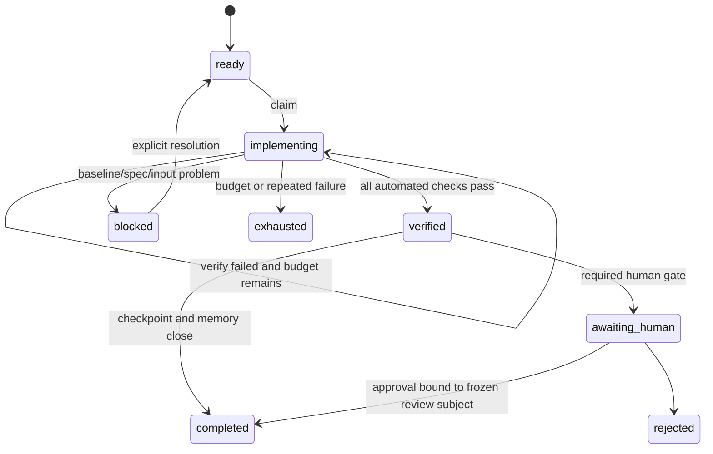

# AI Harness 自动推进协议

## 1. 设计目标

Harness 不是“帮 AI 多跑几个测试”的脚本，而是一个小型控制面：AI 不能自行选择目标、扩大写权限、减少验收、改参考答案或用旧证据宣称完成。它的上游是 Android Requirement Intake：源码先形成 Fact/Requirement，Work Item 只能消费已发布 clause，不能自己充当需求。

控制面使用 JSON，运行器只依赖 Python 3 标准库。工作项 spec 不保存可变状态。本地 v1 以 `project/state.json` 为物化状态快照，哈希链事件用于审计转换和发现半事务，并不宣称可以单独 replay 出全部状态；Harness 是协作流程中唯一合法写入者。

本地 Harness 是防误操作的 cooperative guardrail，不是对同权限恶意 Agent 的安全边界。真正无人值守时，状态、Evidence 头和审批由 AI 不可写的可信 Supervisor/CI 持有，详见 `trusted-supervisor.md`。

## 2. 状态机



终态为 `completed / rejected / exhausted / cancelled / superseded`。预算耗尽不是完成。

## 3. 单次 AI 循环

```text
doctor
→ next
→ context <id>
→ claim <id>
→ 确认 baseline 与 scope
→ 最小实现
→ verify <id>
→ 失败时按结构化证据修复，最多预算次数
→ 验证通过后更新 capability / COMP / PIT / ADR
→ 写 checkpoint
→ close <id>
→ doctor
```

每个 invocation 只处理一个工作项，默认最多三轮“修改 → 定向验证”。同一失败指纹连续出现两次即停；基础设施故障只允许一次重试。

## 4. 工作项职责

每个 immutable work item 必须声明：

- 目标能力、依赖项、优先级和风险；
- allow/deny 写路径、文件/行数预算；
- Android 源锚点、架构不变量和 ADR；
- 可机器验证的 acceptance criteria；
- required checks 和 fixture；
- wall clock、循环、文件与测试预算；
- 人工门禁和停止条件；
- 预期的能力状态/兼容/Pitfall/ADR 记忆更新。
- Requirement 模式、精确 revision/clause 与对应 AC；实现项引用的需求必须为 `implementation_ready`。

Harness 的 `next` 只选择依赖已完成且优先级最高的 ready 工作项。`claim` 先运行 baseline checks，再记录 base commit、既有脏文件 fingerprint、能力 revision 和 lease。写范围与既有用户脏文件相交时拒绝领取；连续推进应在每项完成后提交原子变更，或始终使用独立 worktree。

## 5. Verify 与路径约束

`verify` 执行以下固定步骤：

1. 重新执行事件哈希链、lease、config/spec hash 验证；
2. 计算自 claim 起的 commit + working tree 变化；
3. 检查 allow/deny path、最大文件数和 changed lines；
4. 检查 protected golden/schema/policy/ADR；
5. 执行架构 import/禁止符号检查；
6. 从 Harness config 解析 required checks；每条 AC 必须映射到 check、fixture 或 close memory gate；命令使用 argv 数组，不执行 shell 字符串；
7. 捕获退出码、时间、输出 hash 与脱敏尾部；
8. 检查前后候选路径、内容、类型、mode 和 Git index 必须一致，再生成 Evidence；Evidence 同时绑定 baseline、架构内容摘要、golden、fixture、依赖锁和 Harness 配置；
9. 书源工作项额外绑定 SourceLab control 与 selection digest；扩展行为必须提供独立 case-role candidate，并经 provenance review 后才能提升为 environment reference；
10. 绑定 Android intake control 与 Requirement selection；claim 后 Fact/Requirement drift 直接失败；
11. 通过则进入 verified，否则保留 implementing 并计入循环预算。

AI 无权传入“这次少跑哪些测试”。未来加入 test routing 时，只由受保护 config 根据 diff 选择 T0～T6。

## 6. Close 是记忆事务

验证通过不等于完成。`close` 还要求：

- checkpoint 引用最新 passing Evidence；
- capability revision 相对 claim 时递增，且 `updated_by` 是当前工作项；
- 架构变化引用 proposed ADR 并进入人工门禁；
- Android/iOS 新差异有 COMP 记录，或明确说明无差异；
- 非显然可复发问题有 PIT 记录，或明确说明没有长期 Pitfall；
- 剩余事项、风险和下一步不被隐藏；
- 所有 approval 与 work-item hash、Evidence 和冻结的 review-subject hash 一致。

无人工门禁时 Harness 才进入 completed；否则进入 awaiting_human。

## 7. Evidence 内容

每次 verify 生成 JSON，至少包含：

- run ID、work-item/spec hash；
- base/head/tree/diff hash和实际改动路径；
- Android baseline、Harness config、架构规则、fixture/golden manifest 和依赖锁 hash；
- Android Fact Inventory、Requirement selection 与 intake control hash；
- Xcode、Swift、Python、macOS 版本；
- 每条命令 argv、cwd、退出码、耗时、stdout/stderr hash与脱敏尾部；
- 预算消耗、失败分类/指纹；
- 最终 Harness 决策和复现命令。

本地 Evidence 可进入 Git 作为开发事实；大产物只保存 URI/hash。CI 必须在最终代码树重跑，不能直接信任旧本地 Evidence。

## 8. 人工门禁

Approval 必须绑定 work-item hash 和 `review_subject_sha256`。该摘要覆盖代码、能力、checkpoint、COMP/PIT/ADR，排除 state/status/events/Evidence/approval，避免审批自引用；候选变化后自动失效。AI 不得生成 approval。本地 reviewer 字段只是流程校验，真正人工身份与签名必须由可信 CI/审批服务验证。

若本次新增 `intentional_difference` 或 `accept_difference`，Harness 动态追加 `oracle-adjudication` gate；对应 accepted ADR 必须在正文显式绑定具体 COMP ID，不能复用通用架构 ADR 绕过语义决策。没有差异的工作项不因此停顿。

需要门禁的典型事项：架构/依赖/迁移、golden/normalizer、权限/capability、测试降级、accepted intentional difference、超预算大改。

## 9. 自动连续推进的外层编排

Harness CLI 只负责确定性状态和验证；真正反复唤起 AI 的 orchestrator 使用下列伪代码：

```text
while harness doctor is green:
    confirm trusted Android inventory and Requirement catalog projection
    item = harness next --json
    if item is none: stop "queue empty"
    invoke one agent with context(item)
    wait for completed / awaiting_human / blocked / exhausted
    if completed: continue
    stop and surface structured reason
```

这条循环故意在人工门禁、红色基线、重复失败、lease 过期、预算耗尽和队列为空时停下；“自动推进”不等于无限自治。本仓只提供确定性控制面，Agent 调用凭据与受信 patch 发布器属于外部 Supervisor。
