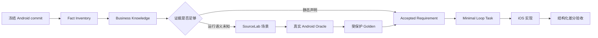

# Android 源码驱动的需求产生机制

Android 固定 commit 是业务知识来源，但源码阅读结论不是运行期 expected。当前链路是：



核心规则：

- Android 架构不直接复制；只提取数据合同、入口、状态转换和可观察行为；
- 字段或分支存在只能证明静态事实，不能替代真实 Android 运行结果；
- 书源运行语义以源码对齐为主，测试用于发现偏差，不能由有限测试反向定义；
- 缺少运行证据时先扩展 SourceLab 和 Android Oracle，不生成产品实现 Task；
- iOS 平台决定、依赖、权限和有意差异单独记录为 ADR/Requirement；
- Android baseline 已冻结，因此当前只做增量知识补全，不维护升级 diff 流程。

入口：

```bash
python3 -B ios/harness/android-intake/android_intake.py doctor --root .
python3 -B ios/harness/business-knowledge/business_knowledge.py doctor --root .
python3 -B ios/loop/loop.py next
```

Fact Inventory 绑定 Android commit、blob、symbol 和 extractor 输出。业务 Claim 必须引用
这些锚点；运行 Claim 还必须引用受保护 Android Golden。Minimal Loop 直接消费
Requirement、Claim、Architecture Driver 和 Golden，不再生成 WorkItem selection。
