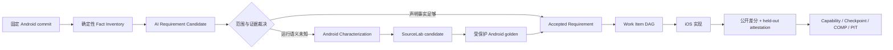
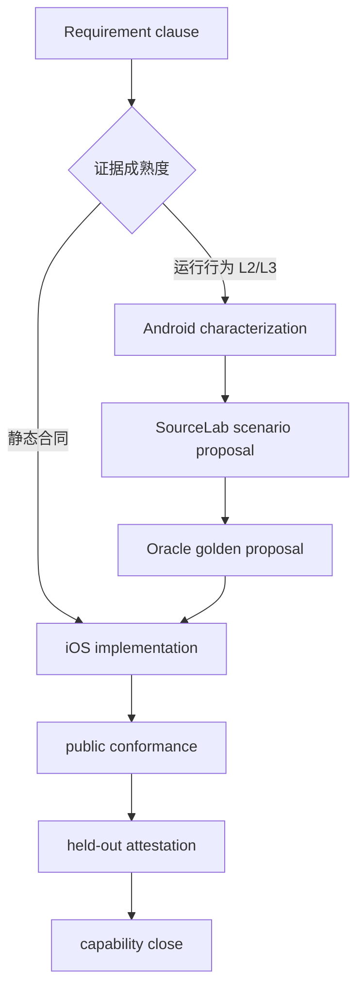

# Android 源码驱动的需求产生机制

## 1. 定位

Android Legado 是 iOS 兼容行为的主要事实来源，但源码声明本身不是需求，更不是 expected result。需求摄取层位于 Android baseline 与 AI Work Item 之间，负责把“代码里有什么”逐步收敛为“iOS 应交付什么、用什么证据证明”。



AI 可以扫描、聚类、起草候选、生成验证 DAG 和实现已发布工作项；AI 不能自行把候选提升为 accepted、更新 Android baseline、改 golden、改 Oracle 或把源码阅读结论当成测试答案。

## 2. 三层权威对象

### Android Fact

Fact 只陈述机械可复现的事实：字段、类型、默认字面量、完整 symbol、生产入口、文件 blob、受控 detector 结果与证据等级。稳定身份不使用行号或 commit；行号只用于导航。

```text
fact_id          AF-WEBBOOK-CONTENT-ENTRYPOINT
fact_key         book-source.pipeline.content
symbol_id        kotlin://.../WebBook/getContentAwait
revision         hash(normalized extractor payload)
anchor           commit + git blob + path + symbol + display lines
support_state    declaration_only / active_untested / active / dormant
```

当前 v1 extractor 只扫描 allowlist 中的 Kotlin data class 主构造器和 `WebBook.*Await` 生产入口。无法唯一识别时失败关闭并报告 `extractor_drift`，不静默少报，也不使用正则全仓猜调用图。

### Requirement

Requirement 描述可观察合同，并明确来源：

- `android_observed`：Android 中存在的跨平台行为或数据契约；
- `ios_product_decision`：未知字段保留、StoreSafe 限制、原生交互等 iOS 产品决定；
- `ios_enabler`：模块边界、Sendable、强类型 ID 等工程前置。

每条 clause 必须声明证明方式：`static_source / android_oracle / architecture_decision / human_adjudication`。accepted 只表示进入产品范围，不表示已经可以实现；`readiness` 独立表达 `characterization_required / decision_required / implementation_ready`。

正式 Requirement revision 不原地改写语义。变化创建新 revision、写 `supersedes`，并让旧 Work Item/Evidence 因 selection digest 变化而 stale。拒绝或延期必须保留 tombstone，避免下次扫描重复生成。

### Work Item

Work Item 是 Requirement 的一次有界交付，不再充当需求本身。它必须选择精确 Requirement revision 和 clause，并声明模式：

- `enabler`：只建立前置能力，可引用尚待 characterization 的需求；
- `characterization`：补 Android runner、场景或行为证据；
- `implementation`：只能引用 `implementation_ready` 的需求；
- `verification`：补公开差分与回归证据；
- `control_plane`：不实现产品语义，必须说明不适用原因。

每条 acceptance criterion 用 `requirement_clauses` 回指合同。Harness 拒绝未覆盖 clause、未知 revision、claim 后 drift，以及实现尚未 ready 的行为。

## 3. 证据等级与自动动作

| 等级 | 确定性证据 | 允许的自动动作 |
|---|---|---|
| L0 | 注释、字符串、依赖提示 | 只索引，不生成需求 |
| L1 | data class/schema/UI 声明 | 生成观察项；纯数据表示可形成静态合同 |
| L2 | 从受控生产入口可达 | 生成候选与 characterization DAG |
| L3 | Android 示例或可执行测试命中 | 自动规划 SourceLab/Oracle proposal |
| L4 | 固定 runner 对同一 fixture 生成受保护 canonical golden | 可排 iOS 行为实现与差分任务 |

等级由 extractor/Oracle 证据确定，AI 不能自行打分。字段存在但没有生产读取，只能是 `declaration_only`；例如 dormant 字段可以进入无损 DTO，但不能自动产生用户功能。存在生产分支但没有测试的能力，如正文分页，只能先生成 characterization，而不能把 AI 阅读出的顺序、错误或并发语义直接写进 iOS AC。

## 4. 初次盘点与后续增量

当前仓库 baseline 是唯一初始 commit，所以第一次运行必须做全量能力盘点：

```text
in-scope Android roots
→ Fact Inventory
→ 与 iOS Capability/Requirement Catalog 求差集
→ candidate / accepted / deferred / dormant disposition
```

以后升级 Android 时保留两个 commit：

- `accepted_android_baseline`：当前 Oracle 与产品事实；
- `observed_android_snapshot`：准备评估的新 commit。

diff 只比较 extractor 的语义输出，分类为 `added / removed / modified / moved_anchor / reachability_changed / dependency_changed / extractor_drift`。注释、格式和局部变量改名不制造需求；被引用 fact revision 改变只使相关 selection stale，不让全项目无差别失效。

## 5. 候选聚类与去重

AI 只能从有效 Fact ID 生成候选，且每个可观察陈述都必须能回指 fact 或设计决定。去重键为：

```text
capability + observable_behavior + profile
```

同一能力的字段声明、编辑入口、调用分支和测试证据应聚成一个候选，而不是多个任务。候选状态建议：

```text
observed → proposed → characterizing → ready_for_decision
         → accepted / rejected / deferred
accepted → planned → covered → superseded
```

每个 in-scope Fact 最终必须有 `implemented / covered_by / intentional_omission / unsupported / deferred` disposition；未映射 Fact 是摄取失败，不能静默消失。

## 6. Requirement Compiler 生成任务 DAG

编译器产生的不是一个“大任务”，而是按证据缺口生成最短 DAG：



生成规则：

1. 已有 reference environment case 且已有对应 Android attestation：直接复用；
2. 缺网站行为：先生成 `scenario_proposal`，禁止写 Swift/golden；
3. 缺 Android 输出：生成 `oracle_promotion`，禁止写 scenario/Swift；
4. 需求 `implementation_ready` 后才生成产品实现项；实现项只能 reuse，禁止写 scenario/golden/policy；
5. 有意差异、WebView/权限扩张、依赖、数据迁移或平台专属行为进入人工 gate。

当前 Harness 已实现 selection 绑定与 readiness 门禁；自动创建 proposal/DAG 仍由后续受信 Supervisor 完成，仓内普通 AI 没有 publish/accept 命令。

## 7. 与 SourceLab 的关系

Requirement 指定需要哪些远端环境行为；SourceLab 提供确定性刺激与原始响应；Android Oracle 提供业务 expected。三者不可互相替代。

只要结果受请求、响应字节、session、时间或网络故障影响，就必须检查 SourceLab 缺口。纯 BookSource JSON round-trip、Room、阅读器本地状态和 UI 不需要本地站点。

SourceLab 的 `environment_reference` 仅表示路由、字节、限制和 provenance 已审核；它不表示 Android/iOS 解析正确。`oracle_verified` 与 Capability `verified` 是另外两层状态。环境能力从 planned 升为 active 只要求受审的 case-role 覆盖；产品实现仍必须等 Android golden。

覆盖按每个 behavior 独立标记 `nominal / boundary / malformed / denied`，不得使用一个全局 positive/negative 给所有行为套语义。例如“搜索为空”对 search pipeline 是 boundary，但对 GET query transport 仍是正常请求；HTTP 404 也不是相对 URL 解析反例。后续 scenario schema 要把 case-role 与 Android fact/branch trace 绑定。

## 8. Harness 与防漂移门禁

Harness 对需求层执行以下约束：

- inventory 固定 Android commit、tree、git blob、extractor/policy/control digest；
- accepted catalog 的 semantic key 唯一，Fact/Requirement 双向引用完整；
- capability 与 Work Item 只能引用 catalog 中精确 revision/clause；
- claim 冻结 `android_requirement_selection_sha256`；verify 前变化立即报 `REQUIREMENT_DRIFT`；
- Evidence 和 Checkpoint 同时绑定 intake control 与 selection digest；
- capability assurance 冻结 requirement refs、required evidence 与 freshness inputs；
- 需求/Fact/场景/golden/实现的写范围互斥；
- ordinary Agent 无权更新 baseline、accepted Requirement、inventory/catalog、golden 或 policy。

无人值守时，inventory/catalog/work-item manifest、Approval 与事件头必须由可信 CI/Supervisor 签名或放在 AI 不可写存储；仓内哈希只能防协作误操作，不能抵抗同权限恶意重写。

## 9. 项目记忆

需求层新增两类长期事实：

- Fact Inventory：当前 Android baseline 中被摄取的确定性事实；
- Requirement Catalog：已接受的产品范围、clause、成熟度和 lineage。

AI 草稿进入 `requirement-proposals/`，不进入权威 Catalog。Checkpoint 记录本项选择的 Requirement、Fact selection、SourceLab selection、Evidence、差异、Pitfall 和剩余 blocker。baseline 升级时生成 impact report：哪些 Requirement revision、Work Item、Capability 与 Evidence stale，以及应创建哪些 characterization DAG。

## 10. 当前入口

```bash
python3 -B ios/harness/android-intake/android_intake.py inventory --root .
python3 -B ios/harness/android-intake/android_intake.py catalog --root .
python3 -B ios/harness/android-intake/android_intake.py doctor --root .
python3 -B ios/harness/android-intake/android_intake.py selection --root . --work-item IOS-SOURCE-FORMAT-001
python3 -B ios/harness/harness.py context IOS-SOURCE-FORMAT-001
```

首版 sensors 覆盖 BookSource/Rule 构造器以及 WebBook 的 search、explore、book info、toc、content 入口。下一步按优先级增加具名 detector：`AnalyzeUrl` 请求选项、规则模式、目录/正文分页与环检测、实际编辑表面、默认书源使用统计、Android 测试/runner attestation；不直接做全仓通用 AI AST 推断。
