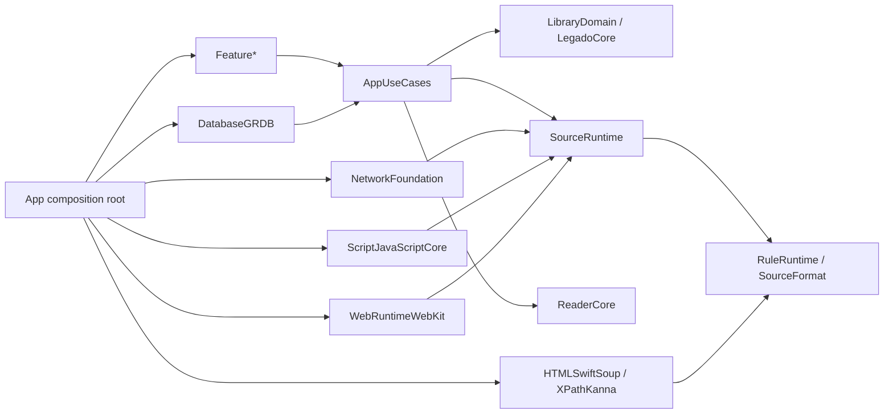

# Legado iOS 架构设计

版本：1.0  
适用范围：`ios/`  
基线：Android Legado 当前冻结 commit，见 `ios/project/baseline.json`

## 1. 目标与非目标

目标是实现“兼容内核 + 原生 iOS 外壳”：书源 JSON、规则执行、搜索/详情/目录/正文与阅读数据尽量兼容 Android；UI、并发、持久化和导航按 iOS 原生模型重建。

AI 推进控制面采用
[`Minimal Loop v2`](minimal-loop-v2.md)：从已发布业务知识直接派生唯一 Task，
以结构化书源验收和 Simulator UI 验收闭环；控制面不是产品模块，不得反向影响下述
产品依赖边界。

首要质量属性按优先级排序：

1. 兼容行为可离线复现、可逐阶段比较；
2. 不可信书源、脚本、网络和归档有明确能力边界；
3. Swift 6 并发安全，UI 不承担解析和 I/O；
4. 核心不依赖具体数据库、网络、DOM、脚本或 UI 框架；
5. 每项能力都能由 Harness 独立验收与追溯。

非目标：逐类翻译 Activity/ViewModel、直接打开 Android SQLite、第一版覆盖全部 EPUB/JS/WebView 边角、让 AI 自行改变架构或参考答案。

## 2. 架构不变量

这些编号是工作项、ADR 和自动检查的稳定引用：

| 编号 | 不变量 |
|---|---|
| ARCH-001 | 项目 Target 依赖只能沿 `architecture-rules.json` 的方向。 |
| ARCH-002 | Core、Domain、RuleRuntime、ReaderCore 禁止导入 SwiftUI、UIKit、WebKit、GRDB。 |
| ARCH-003 | Feature 禁止直接使用 URLSession、GRDB、WKWebView、JSContext 和 FileManager。 |
| ARCH-004 | Live 实现只能在 App composition root 实例化。 |
| ARCH-005 | Repository、Transport、Runtime 协议由消费方 Target 定义。 |
| ARCH-006 | 禁止业务全局单例和可变 static 状态。 |
| ARCH-007 | Feature Store 必须为 `@MainActor`，状态只读暴露，副作用通过 UseCase。 |
| ARCH-008 | 跨并发边界的公开值必须为 Sendable；三方 DOM、JSValue、数据库 Record 不得逃逸。 |
| ARCH-009 | `CancellationError` 原样传播，不能映射为业务失败或用户提示。 |
| ARCH-010 | Route 只携带稳定 ID 和小型值类型，不携带 Store、Record、闭包。 |
| ARCH-011 | 每次书源操作必须产生 TraceID，并记录明确的 SourceStage。 |
| ARCH-012 | 书源 JSON round-trip 必须保留未知字段。 |
| ARCH-013 | StoreSafe 产物不得链接任意脚本或动态页面执行 Target。 |
| ARCH-014 | Golden、normalizer 和阈值只能经人工审核更新。 |
| ARCH-015 | Database Record、传输 DTO、Domain Model 必须分离。 |
| ARCH-016 | Android schema 71 不是 iOS schema 版本；跨端数据只走显式 Codec。 |
| ARCH-017 | 产品 Work Item 必须绑定已发布 Requirement revision/clause；Android Fact 或 selection 漂移后旧 Evidence 失效。 |
| ARCH-018 | Android 源码声明只产生 Fact；未达到所需证据等级的行为不得直接进入 iOS 实现队列。 |

## 2.1 Android 需求摄取层

Android baseline 是兼容事实源，Requirement Catalog 是产品范围源，Work Item 是一次交付载体；三者不能合并。受控 extractor 从固定 commit 提取字段/入口等 Fact，AI 只能据此生成候选。静态数据合同可在 L1 进入实现，运行语义必须经 SourceLab 刺激与 Android Oracle 达到 L4 后才进入产品实现。

```text
Android commit → Fact Inventory → Requirement Candidate
→ scope/evidence decision → Accepted Requirement
→ characterization/enabler/implementation/verification Work Item DAG
```

完整契约、证据等级、去重与 baseline 升级规则见 `android-requirement-intake.md`。

## 3. 模块与依赖方向



### 3.1 内核 Target

| Target | 职责 | 允许的项目依赖 |
|---|---|---|
| `LegadoCore` | ID、Clock、Trace、JSONValue、稳定错误基础 | 无 |
| `LibraryDomain` | Book、Chapter、Progress、Bookmark 等领域值 | Core |
| `SourceFormat` | Android 书源 JSON DTO、校验、版本兼容、未知字段 | Core |
| `RuleRuntime` | 规则 parser/AST、CSS/XPath/JSONPath/Regex/JS 编排与 ports | Core |
| `SourceRuntime` | 搜索、发现、详情、目录、正文流水线与策略 | Core、Domain、SourceFormat、RuleRuntime |
| `ReaderCore` | 正文归一化、语义锚点、分页、预取策略 | Core、Domain |
| `AppUseCases` | 书架、搜索、加书、换源、进度与 Repository ports | Core、Domain、SourceRuntime、ReaderCore |
| `TestSupport` | Fixture、fake、固定 Clock/UUID 和 Trace matcher；不得 import XCTest/Testing | API Target |
| `ConformanceCLI` | macOS 离线 runner；只注入 FixtureTransport，不链接真实网络实现 | Core、Runtime、TestSupport、规则 adapters |

### 3.2 平台适配 Target

| Target | 唯一职责 |
|---|---|
| `DatabaseGRDB` | Record、SQL、migration、Repository 实现 |
| `NetworkFoundation` | URLSession、编码、Cookie、限流、HTTPTransport 实现 |
| `HTMLSwiftSoup` | HTML5 DOM 与 CSS 后端 |
| `XPathKanna` | XML 与 XPath 1.0 后端 |
| `ScriptJavaScriptCore` | JavaScriptCore backend、兼容 prelude 和白名单 bridge |
| `WebRuntimeWebKit` | FullCompat 动态页面执行；全部位于 MainActor |
| `WebLoginKit` | 两种 profile 共用的受控登录 WebView，不执行书源动态规则 |
| `ArchiveZIPFoundation` | ZIP 容器访问与外层解压安全策略 |
| `ImageNuke` | 图片请求合并、解码、降采样、缓存和预取 |

三方类型必须在适配器内终止。对外只允许项目自有、不可变、`Sendable` 的值类型。

### 3.3 UI 与组装

`DesignSystem` 只含 token 和通用控件。`FeatureShelf/Search/BookDetail/Reader/Sources/Settings` 使用固定结构：

```text
FeatureSearch/
├── SearchState.swift
├── SearchAction.swift
├── SearchStore.swift
├── SearchView.swift
├── SearchOutput.swift
└── Components/
```

`LegadoStoreSafeApp` 和 `LegadoFullCompatApp` 是唯一 composition root。Feature 通过 Output 报告意图，App 把 Output 翻译成 Route；Feature 不直接依赖 Router。

## 4. 状态、导航和依赖注入

复杂 Feature 采用轻量单向数据流，不在首版引入 TCA：

```swift
@MainActor
@Observable
final class SearchStore {
    private(set) var state: SearchState
    private let searchBooks: SearchBooksUseCase
    private var effectTask: Task<Void, Never>?

    func send(_ action: SearchAction) {
        // reduce state, then start a tracked effect
    }
}
```

- View 不直接读 Repository，也不拥有不可追踪的长任务。
- 新请求取消旧请求，并用 request ID 防止迟到结果覆盖。
- `LoadState` 显式区分 idle/loading/loaded/failed，可保留 previous value。
- 测试使用固定 Clock、UUID、locale、timezone 和 fixture service。

`AppRouter` 为 `@MainActor @Observable`；每个 Tab 保留独立路径。Route 只携带 `BookID/SourceID/ChapterID`。iPhone 使用 `NavigationStack`，iPad 用同一 Route 模型映射到 `NavigationSplitView`。

依赖只用显式构造器注入：

```swift
struct AppContainer {
    let books: any BookRepository
    let sources: any SourceRepository
    let sourceRuntime: any SourceExecuting
    let readerFactory: ReaderSessionFactory
    let clock: any Clock
    let idGenerator: any IDGenerating
}
```

只允许 `AppContainer.live(policy:)` 和 `AppContainer.test(fixtures:)` 组装。禁止 Service Locator、业务 `.shared` 和把 service 隐藏进 SwiftUI Environment。

## 5. 书源执行流水线

固定阶段如下，每阶段都写入脱敏 trace：

```text
load source
→ validate and normalize source JSON
→ compile URL template and rules to AST
→ enforce RuntimePolicy/capabilities
→ acquire source rate limit
→ build deterministic HTTPRequest
→ URLSession or approved WebRuntime
→ decode charset with evidence
→ create document session
→ select list nodes
→ evaluate fields
→ normalize relative URLs and values
→ map typed domain result
→ emit Traced<Result>
```

关键 ports：

```swift
protocol SourceExecuting: Sendable {
    func search(source: SourceID, query: SearchQuery) async throws -> Traced<[BookCandidate]>
    func bookInfo(source: SourceID, locator: BookLocator) async throws -> Traced<BookInfo>
    func chapters(source: SourceID, book: BookLocator) async throws -> Traced<[Chapter]>
    func content(source: SourceID, chapter: ChapterLocator) async throws -> Traced<ChapterContent>
}

protocol RuleEvaluating: Sendable {
    func evaluate(
        _ rule: CompiledRule,
        input: RuleInput,
        context: RuleContext
    ) async throws -> RuleValue
}

protocol HTTPTransport: Sendable {
    func execute(_ request: HTTPRequest) async throws -> HTTPResponse
}
```

多书源搜索输出 `AsyncStream<SearchEvent>`。单源失败产生 `.sourceFailed`，不能终止其他源；调度器必须限制总并发和单源 `concurrentRate`。

### 5.1 规则后端

- CSS：SwiftSoup 后端，补齐 jsoup 1.16.2 的空值、文本、索引与绝对 URL shim。
- XPath：Kanna 仅作为 XPath/XML 后端；短期允许双 DOM，跨 DOM 重新解析必须记录 trace。
- JSONPath：项目持有 `JaywayCompatJSONPath` parser/AST/evaluator；三方实现只能作为实验对照。
- Regex：NSRegularExpression 外包一层 Java Pattern 兼容语义。
- JavaScript：JavaScriptCore 只是 backend；Host API 为白名单命令，禁止把 Swift 对象直接完整暴露。
- WebKit：动态页面和登录专用，不能代替规则 JS runtime。

### 5.2 SourceLab 本地书站

SourceLab 将同一份受版本控制的 route/原始响应映射为两种输入：T2/T3 由 `FixtureTransport` 无 socket 消费，T4 才绑定 `127.0.0.1:0` 供 `NetworkFoundation`/URLSession 集成测试。它负责稳定模拟 GET/POST、Header、Cookie、redirect、charset、分页、限流、故障与动态页面环境，但不保存业务 expected result，也不替代 Android Oracle。

每个书源 behavior 必须在 coverage policy 登记，并按该 behavior 独立声明 nominal/boundary/malformed/denied case-role；不能把一个全局正反标签套给不同层级。场景、Android golden 与 iOS 实现必须由不同工作项变更；随机端口通过本次运行的精确 authority mapping 还原为 `http://sourcelab.test`，不得进入 canonical envelope。环境 reference 不等于 Oracle verified，完整契约见 `source-lab.md`。

## 6. 阅读器流水线

```text
Raw ChapterContent
→ ContentNormalizer
→ ReaderDocument
→ Layout/PaginationEngine
→ ReaderSession actor
→ ReaderStore
→ SwiftUI presentation
```

阅读进度以语义锚点为主，同时保存 Android 兼容的章节索引/字符偏移；绝不把“页码”作为持久进度。字号、宽度、动态字体或设备变化后重新分页，通过锚点恢复位置。

SQLite 保存元数据、目录、进度、书签；大正文和图片进入 Application Support/Caches，由 `ContentFileStore actor` 原子管理。

## 7. 并发所有权

| 可变状态 | owner |
|---|---|
| SwiftUI、Store、Router、WKWebView | `@MainActor` |
| 跨源并发和单源限流 | `SourceScheduler actor` |
| Cookie 与 source session 变量 | `CookieVault actor` |
| 章节加载、前后章预取、进度防抖 | `ReaderSession actor` |
| 正文与图片缓存文件 | `ContentFileStore actor` |
| JavaScriptCore context | 专用串行隔离器；每 SourceSession 独立 VM/Context |
| SQLite | GRDB `DatabasePool`：并发读、事务写 |

Swift 语言模式为 6，strict concurrency 为 complete。禁止未经 ADR 的 `Task.detached` 或 `@unchecked Sendable`。actor 只保证串行，不保证固定线程；线程亲和型框架必须放在正确 executor。

## 8. 持久化和错误

首选 GRDB，不使用 SwiftData 承接复杂 schema。`BookRecord/ChapterRecord/SourceRecord` 与 Domain Model 通过 Mapper 转换。Android 备份由 `LegacyImportCodec` 显式导入，不直接共用 SQLite 文件。

统一错误结构至少包含：

```swift
struct AppIssue: Error, Sendable {
    let code: IssueCode
    let stage: SourceStage?
    let sourceID: SourceID?
    let traceID: TraceID
    let retryable: Bool
    let recovery: Recovery
}
```

`SourceStage` 至少区分 URL 模板、请求、编码、列表定位、字段解析、脚本、WebView 和正文净化。原始错误与响应只进入脱敏 Trace；UI 只接收稳定错误码和恢复动作。

## 9. 两种发布 Profile

| 能力 | StoreSafe | FullCompat |
|---|---:|---:|
| 声明式规则 | 是 | 是 |
| 签名/内置书源 | 是 | 是 |
| 任意书源导入 | 否 | 是 |
| 任意 JavaScript | 否 | 是 |
| 动态页面脚本 | 否 | 是 |
| 登录 WebView | 是 | 是 |
| 私网访问 | 否 | 用户显式控制 |

StoreSafe 在编译链接闭包中排除 `ScriptJavaScriptCore`、动态 Web runtime 和书源开发器；不能只隐藏 UI 开关。两种构建还要在执行 URL、脚本、WebView、文件和私网访问前由 `RuntimePolicy` 二次校验，拒绝时返回稳定 `.capabilityDenied`。

SwiftPM 分别暴露 `LegadoStoreSafeKit` 与 `LegadoFullCompatKit` 根 library product，Harness 从根 product 递归计算实际 Target 闭包并校验 required/forbidden targets；测试 Target、TestSupport 与 ConformanceCLI 禁止进入任何生产 product。App target 只能链接对应 profile product，不能逐个拼装底层 Target。

## 10. 架构自动验证

Harness 至少检查：

- Swift import 是否越过 Target 依赖矩阵；
- 三方模块是否只出现在指定 Adapter；
- 核心和 Feature 是否导入禁止框架；
- 是否出现业务 `shared`、可变 static、`Task.detached`、`@unchecked Sendable`；
- StoreSafe 是否链接 forbidden target；
- 工作项实际修改是否超出 allow list 和 diff 预算；
- 依赖、golden、schema、normalizer、ADR 是否被普通任务修改。
- SourceLab behavior 是否满足所需 case-role，scenario/runner/golden 是否被同一任务越权修改。

源码级正则检查只作为快速门禁，不能代替 Swift 编译器、strict concurrency 和测试。

## 11. ADR 触发条件

出现以下任一情况，AI 必须停止并创建 proposed ADR：

- 新增 Target、增加/反转依赖边；
- 新增或升级外部 package；
- 修改公开协议、书源格式或规则语义；
- 新增数据库 migration；
- 修改身份、阅读进度或同步模型；
- 修改 actor/MainActor 所有权；
- 新增全局共享状态；
- 扩大网络、文件、脚本、WebView 或私网 capability；
- 修改 StoreSafe 链接闭包；
- 修改 golden/normalizer/验收阈值；
- 修改最低 iOS、Swift 或 Xcode 基线；
- 接受有意跨端差异。

保持公开契约不变的内部实现、叶子 UI 和新增普通测试不需要 ADR。已 accepted ADR 的决策正文不可改写；改变决定必须新增 ADR 并 supersede 旧 ADR。
