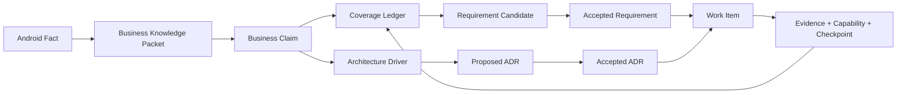

# 业务知识与架构驱动控制面

版本：1
适用范围：`ios/` 初始化与后续 Android → iOS 迁移工作
控制实现：`ios/harness/business-knowledge/`

> 状态：`derived_control_contract`。本文件是在 accepted `ADR-0004` 记忆事务下对 Harness 的可执行细化，不是新的 accepted 架构来源，也不替代 `architecture.md`、`project-memory.md` 或 ADR。是否把知识层提升为正式架构权威，必须由后续 Architecture Driver、proposed ADR 和人工批准完成；此前能力状态保持 `partial`。

## 1. 为什么需要这一层

Android 源码是冻结基线上的业务事实来源，但 Android 当前的类、模块和调用方式既不天然正确，也不等于 iOS 产品需求。iOS 架构必须先理解业务边界、运行语义、状态生命周期、UI 结构和外部约束，再根据 iOS 的质量属性作出设计。

Business Knowledge 控制面位于 Android Fact Inventory 与 Requirement Catalog 之间，解决三个问题：

1. 把分散源码事实组织成可引用、可修订、可冲突检测的业务知识；
2. 明确每条知识是否已有静态或 Android 运行证据、是否进入产品范围、是否已经交付；
3. 只把经过发布和范围裁决的知识送入 Requirement、ADR 与 Work Item，避免 AI 在一次对话里同时定义问题、答案和实现。

它不是新的需求系统，也不把 Android 架构复制到 iOS。测试用于验证和防回归，不能替代从冻结源码、真实书源输入与 Android 运行结果中提取业务知识。

## 2. 权威链



这条链不是“源码扫描后自动生成产品代码”。不同对象各自只回答一个问题：

| 对象 | 回答的问题 | 权威边界 |
|---|---|---|
| Android Fact | 固定 commit 上能机械证明什么？ | 只陈述 extractor 可复现的字段、symbol、入口和 reachability |
| Packet | 哪些事实属于同一 bounded context 或业务主题？ | 聚合与定位知识，不决定产品范围 |
| Claim | 对业务数据、行为、生命周期、UI 结构或风险作出什么原子陈述？ | 必须带稳定 ID、revision、support、依赖和冲突 |
| Coverage Ledger | 这条已发布 Claim 是否已验证、如何处置、交付到哪里？ | 每个 current published Claim 恰有一个 entry |
| Architecture Driver | 哪些 Claim 形成质量属性、约束或架构问题？ | proposed Driver 仅供同批审查；published Driver 的未解决状态不能被实现任务绕过 |
| Requirement | 哪些可观察行为进入 iOS 产品范围？ | 只有 accepted revision/clause 才能驱动产品实现 |
| ADR | iOS 如何在约束与质量属性之间取舍？ | 只有 accepted ADR 才是架构决定 |
| Work Item | 本次有界交付做什么、可写哪里、如何验收？ | 精确消费已发布知识与 accepted Requirement/ADR |

不是每个 Claim 都要变成 Requirement。它也可能被标记为 `knowledge_only`、进入 characterization、形成 Architecture Driver、延期、拒绝或明确不支持。Coverage Ledger 必须保留这种处置，防止同一知识在后续扫描中反复出现或静默丢失。

## 3. Packet、Claim、Ledger 与 Driver

### 3.1 Business Knowledge Packet

Packet 使用 `BKP-*` 稳定 ID，按 bounded context、capability 和 subject 聚合一组规模受限的 Claim。Packet revision 不原地改写；新 revision 精确 `supersedes` 前一 revision。

Packet 绑定：

- 固定 Android commit；
- Fact Inventory control digest；
- bounded context、capability 与 subject keys；
- 创建它的 Work Item；
- 所含 Claim 的稳定 ID 与 revision。

Packet 是上下文切片，不是“大而全项目总结”。跨域知识通过 Claim 的精确依赖连接，Harness 只展开所选 Claim 的依赖闭包。

### 3.2 Business Claim

Claim 使用全局稳定的 `BKC-*` ID。它可以表示：

- `composite_static_fact`：多个受控 Fact 组成的静态合同；
- `runtime_behavior`：必须由运行证据确认的行为；
- `business_inference`：从事实推导、仍需产品裁决的业务含义；
- `candidate_invariant`：可能约束 iOS 设计的不变量；
- `risk_or_anomaly`：兼容、安全、生命周期或数据风险；
- `open_question`：当前证据无法回答的问题。

Claim 的 `support.state` 不能由 AI 主观升级。静态知识引用精确 Fact revision；运行知识引用带 Android commit、runner、canonicalizer 与 artifact digest 的 Evidence。`depends_on` 与 `conflicts_with` 都引用精确 current revision。

### 3.3 Coverage Ledger

Coverage Ledger 使用 `BKL-*`，entry 使用 `BKE-*`。它把“知道了什么”与“已经做到什么”分开记录：

- `validation`：需要什么证明、当前是否 supported/verified/disputed；
- `product_disposition`：是否成为需求、Driver、characterization、延期或拒绝；
- `delivery`：关联 Requirement、Work Item、Capability 和 Evidence；
- `computed`：是否已核算，以及 covered/gap/blocked/stale/conflicted 状态。

Ledger 的 revision 与 Knowledge Authority digest 绑定。知识 revision 变化后旧 Ledger 会 stale，不能靠手工改状态继续使用。Ledger 进度变化只改变 Coverage digest，不改变知识本身的 Authority digest。

### 3.4 Architecture Driver

Driver 使用 `DRV-*`。published Driver 只引用 current published Claim；proposed Driver 可以引用
current published Claim，也可以引用其 `created_by` Work Item 在同一
`knowledge.produces` 批次中精确声明的 Packet proposal Claim。它把业务事实翻译成架构决策输入：

- 质量属性和具体 scenario；
- criticality；
- 必须回答的设计问题；
- 需要 characterization、spike 或 ADR 的状态；
- 最终 accepted ADR 与后续 Work Item。

Android 模块划分只能作为来源线索，不能直接成为 Driver 的结论。Driver 在 `open / requires_*` 状态时会阻断相关 implementation；只有 `resolved` 或 `accepted_risk` 且引用 accepted ADR 后才能解除。

同批候选引用不提升 authority。Harness 以
`Work Item metadata.id + knowledge.mode + produces(kind/id/revision) + artifact.created_by`
确定性证明批次归属；重复生产声明、未声明产物、跨 Work Item 引用、错误 revision
或伪造 `created_by` 都会失败。candidate Claim 与 proposed Driver 仍不能被
`knowledge.consume` 或 implementation 选择。

### 失败 reservation 与 Tombstone

`knowledge.produces` 随 Work Item 物化后形成永久 revision reservation。即使 producer
在写出 proposal 前进入 `blocked/rejected/exhausted/cancelled`，该 revision 也不能
被另一个任务复用，否则失败重试会改写 lineage。

终态 producer 没有物理 Packet/Driver 时，由独立的
`control-plane + corrective` Work Item 在
`tombstones/{packets|drivers}/<id>/rNNNN.json` 创建
`KnowledgeRevisionTombstone`。它只记录被保留的 kind/id/revision、原 producer、
真实 terminal status/reason/Evidence，以及创建 tombstone 的纠错任务和时间。

Tombstone 不是空 Packet/Driver：它没有 Claim、forces、promotion 或 published 状态，
不进入 selection、Coverage 或 Knowledge Authority。doctor 只有在原 Work Item 精确
声明 output、状态与 terminal event 一致、物理 proposal/published artifact 均不存在
时才接受。revision 连续性使用“物理 artifact + 有效 tombstone”的并集；后续恢复必须
产生下一 revision 并 supersede tombstoned predecessor。Catalog 用独立 `tombstones`
和 `tombstone_sha256` 暴露 lineage，不把 tombstone 混入 `proposals`。

## 4. 候选与发布隔离

物理目录就是 authority 边界：

```text
ios/project/business-knowledge/
├── packets/
│   ├── proposals/             # candidate，仅供审查
│   └── published/             # 受信发布，Work Item 可消费
├── drivers/
│   ├── proposals/             # proposed，仅供审查
│   └── published/             # active/resolved，Work Item 可消费
├── tombstones/                # 终态 producer 的失败 revision reservation
│   ├── packets/
│   └── drivers/
├── coverage/                  # current Ledger
└── catalog.json               # Harness 确定性生成
```

普通 AI 可以在明确的知识生产 Work Item 中写 proposal，但不能：

- 把 proposal 移到 published；
- 伪造 promotion/approval；
- 直接编辑 Catalog；
- 在同一 Work Item 中生产知识并修改 Swift 产品代码；
- 用 candidate Claim 驱动 Requirement implementation。

知识生产 Work Item 可以原子产出一个或多个 Packet/Driver proposal。proposed Driver
只可引用同一 Work Item 精确 `produces` 的 Packet proposal Claim，或引用既有 current
published Claim；它不能从其他候选批次取数。此规则只让 Packet 与 Driver 作为一组候选
接受审查，不改变 proposal/published 物理隔离、promotion 权限或 authority digest。

发布必须由可信 Supervisor/人工审查后的 publisher 完成。Packet promotion、对应初始 Ledger 与 Catalog 更新必须作为一个受信事务提交，避免出现“已发布 Claim 没有 Coverage entry”的中间状态。发布动作不从本仓的只读 CLI 暴露。

## 5. 摘要与漂移

控制面使用不同摘要表达不同含义，不能合并成一个“大 hash”：

| 摘要 | 覆盖内容 | 不应受什么影响 |
|---|---|---|
| `control_sha256` | policy、schema、校验/选择实现及 Harness 集成语义 | 业务进度 |
| `authority_sha256` | Android baseline、Fact Inventory control、policy、published Packet/Driver revision 与内容 | Coverage 进度、proposal |
| `coverage_sha256` | 全部 current Ledger revision 与内容 | proposal |
| `proposal_sha256` | candidate Packet 与 proposed Driver | published authority |
| `tombstone_sha256` | 终态 producer 遗留的失败 revision reservation | Claim、Driver、published authority |
| `knowledge_selection_sha256` | 当前 Work Item 实际展开的 Claim 上下文 | 未选择的 Claim |
| `coverage_selection_sha256` | 当前 Work Item 显式选择的 Ledger entry 及其 Ledger revision | 其他 Ledger 中未选择的 entry；同一 Ledger 是并发冲突边界 |
| `architecture_driver_selection_sha256` | 当前 Work Item 选择的 Driver 上下文与 resolution | 未选择的 Driver |

Catalog 可从目录内容确定性重建。相同输入必须得到相同结果；Catalog 不匹配即 doctor 失败。Coverage 的日常推进不会让全部知识 authority 失效；但 Ledger revision 是并发边界，同一 Ledger 中任一 entry 的合规更新都会要求基于旧 revision 的 Work Item 重新领取。

## 6. AI 上下文与生命周期

### Context

Work Item 在 `spec.knowledge` 中声明：

- `mode`：`not_applicable / consume / produce / supersede`；
- 精确 `claim_refs`、`driver_refs`、`coverage_refs`；
- 计划产出的 proposal 或 Ledger transition；
- `max_claims` 与 `max_bytes`。

合同没有模糊路径或通配产物。`produces` 的每一项精确为
`{"kind":"packet"|"driver","id":"...","revision":N}`；
`expected_ledger_transitions` 的每一项精确为
`{"id":"BKL-*","from_revision":N,"to_revision":N+1,"entry_updates":[{"id":"BKE-*","set":{"delivery":{...},"computed":{...}}}]}`。
`set` 只能包含 `validation`、`product_disposition`、`delivery`、`computed`，且给出完整目标 section；每个更新 entry 必须属于同一 Ledger 在 `coverage_refs` 中显式选择的 entries，未声明 section、其他 entry 和 `claim_ref` 必须保持不变。终态产品 disposition 必须预先声明当前工作项的精确 approval ref；首次 close 冻结 review subject 并进入 `awaiting_human`，之后由 `approval_issues` 独立校验批准文件、reviewer、tree 绑定和有效期。
`not_applicable` 必须让这些数组全部为空并提供 `none_reason`。Proposal DAG 可以延后
选择具体 Claim，但 Trusted Supervisor 在 materialize 前必须把所有引用解析为精确 current
revision，未完成绑定的节点不能进入 queue。

`context` 只读取 published current revision，递归展开 Claim 依赖闭包，并自动纳入所有引用该闭包的 current Driver；Driver 引入的 Claim 同样必须有显式 Coverage selection。这样 implementation 不能靠省略未决 Driver 绕过门禁。缺 revision、缺 Coverage、引用 candidate 或超过预算都失败关闭；`CONTEXT_OVERSIZED` 不允许静默截断。

### Claim

`claim` 先运行 baseline 检查，再冻结：

- Business Knowledge control digest；
- global authority digest；
- Claim、Coverage 与 Driver 三个 selection digest。

Implementation 还必须满足：Claim support 可用于实现、Coverage 非 stale/disputed/conflicted/blocked/gap、Driver 已解决、每条 AC 都回指它实际覆盖的 Claim。知识生产与产品实现的写范围互斥。

只有 Trusted Supervisor 已 materialize、标记为 `control_plane` 且知识为 `not_applicable` 的治理/纠错任务可以升级控制实现；它可改变 control digest，但 authority 与所有 selection 仍必须保持冻结。普通实现任务的 control drift 一律失败。

### Verify

`verify` 重新生成 Catalog 和 selection，并与 claim 快照逐项比较。任何受控语义、published revision、所选 Coverage 或 Driver resolution 变化都返回 `KNOWLEDGE_DRIFT`，要求重新领取或重新规划，而不是继续使用旧上下文。

Evidence 同时记录这些摘要、实际修改路径和固定检查结果。候选变化可通过 proposal digest 审计，但候选不能改变现有实现任务的 authority。

### Close

`close` 要求 Checkpoint 与最新 passing Evidence 使用同一组 selection digest，并记录：

- 消费与产出的知识引用；
- 精确 Ledger revision transition；
- Requirement、ADR、Capability、COMP/PIT 的变化；
- 未完成风险和下一步。

只允许修改 Work Item 预先声明的 proposal 和 Ledger transition。Knowledge、Requirement、ADR 或产品代码之间若发生新的语义关系，必须通过新的 revision/独立工作项表达，不能在 checkpoint 里补写未经验证的事实。

终态 Work Item 不再用 current Catalog 重算历史 selection；doctor 改为核对其不可变 Evidence 与 Checkpoint。因此 Ledger 从 `N` 合规推进到 `N+1` 不会让已完成任务失效，非终态任务仍会因 revision 漂移停止。

Checkpoint 的 `business_knowledge` 至少固定
`knowledge_selection_sha256`、`coverage_selection_sha256`、
`architecture_driver_selection_sha256`、`produced_refs` 与 `ledger_updates`。
其中 `produced_refs` 必须与 `produces` 一致，`ledger_updates` 必须与
`expected_ledger_transitions` 及最新 Evidence 一致。

## 7. 冲突处理

冲突不能用“最后写入者获胜”处理：

1. current Claim/Driver 的 `semantic_key` 必须唯一；
2. Claim 显式列出 `conflicts_with`；反证 Evidence 使 support 或 Coverage 进入 disputed/conflicted；
3. 新结论创建新 revision 并 supersede，旧 selection 自动 stale；
4. 业务范围冲突进入 Requirement disposition 或人工裁决；
5. 架构取舍进入 Driver，再由新的 proposed ADR 解决；
6. Android 与 iOS 已观察结果不同则创建 COMP，不能改 golden 或 normalizer 消除差异。

发现冲突后，AI 可以生成 characterization、Driver、Requirement 或 ADR proposal，但无权自行接受其中任何一个结论。

## 8. 防自证与真实书源

书源数量和规则组合无法靠穷举测试驱动迁移。书源能力以冻结源码和受控运行证据为主，测试用于覆盖代表性分支、边界和回归。

真实书源链路必须拆开：

```text
真实站点采集 candidate
→ provenance/脱敏/许可审查
→ 固化为 SourceLab 原始响应与场景 proposal
→ 固定 Android runner 对同一输入执行
→ 受信发布 Android canonical golden
→ iOS 实现消费相同输入
→ 公共差分与 held-out 验收
```

`real_source_capture` 只证明输入来自真实世界并记录 provenance；它本身不是业务 expected。运行语义的 expected 必须由固定 Android baseline 的 characterization 产生。SourceLab 只模拟环境，golden 只给出 Android 结果，二者都不能被 iOS 实现反向生成。

为了避免自证：

- 场景/原始响应、Android golden、iOS 实现分别由不同 Work Item 变更；
- 普通 Agent 无 publish、accept、update-golden 命令；
- 实现任务不能写 fixture、scenario、golden、normalizer、policy；
- expected 不能从待验 iOS 输出复制；
- 公开 fixture 用于开发，held-out attestation 由可信环境执行；
- UI 验收以信息结构、层级菜单、导航与状态图为主，平台细节与像素差异单独评估。

## 9. 初始化阶段的使用方式

初始化不是一次性把整个 Android 仓库塞进上下文，而是：

1. 先扫描能力表面，形成 subject/bounded-context proposal；
2. 按 Book Domain、Source Runtime、Reader Lifecycle、UI Topology、Integrations 分包提取；
3. 对每个 Packet 做独立审查、冲突和覆盖核算；
4. 从 published Claim 形成产品范围 proposal 与 Architecture Driver；
5. Requirement/ADR 经受信接受后，编译最短的 characterization/enabler/implementation/verification DAG；
6. Loop Engine 只在这些权威输入和架构约束下逐个推进。

规划草案位于 `ios/project/work-item-proposals/initialization-dag.json`。它是 proposal，不进入 Harness queue，也不会自动 materialize。

## 10. 只读入口

```bash
python3 -B ios/harness/business-knowledge/business_knowledge.py doctor --root .
python3 -B ios/harness/business-knowledge/business_knowledge.py manifest --root .
python3 -B ios/harness/business-knowledge/business_knowledge.py selection \
  --root . \
  --work-item IOS-KNOWLEDGE-CONTROL-PLANE-001
```

CLI 故意没有 `publish`、`accept`、`promote` 或 `materialize`。
