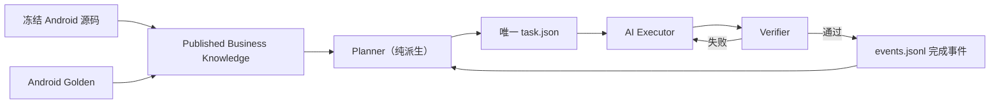

# Minimal Loop v2 架构与迁移合同

状态：已采用  
生效基线：`dff04334426fc0580e3de1acdd8472e096f37113`

## 为什么重构

旧控制面能够严格审计，但把一个交付重复物化成 Candidate、Recipe、WorkItem、
Evidence、Checkpoint、Recovery 和巨大 `state.json`。它已经超过 iOS 产品代码规模，
同时在 Business Knowledge 发布后仍停在 `queue_empty`。这说明成本主要花在控制面
自洽，而不是业务推进。

v2 的目标不是削弱业务、架构或验收约束，而是删除重复表示。

## 唯一权威链

只有三个受版本控制的 Loop 状态：

| 文件 | 作用 | 规模约束 |
|---|---|---:|
| `task.json` | 当前唯一任务；无任务时不存在 | 小于 8 KB |
| `events.jsonl` | 开始、验证、完成和长期知识事件 | 每事件一行 |
| `current.json` | 当前状态投影 | 小于 2 KB |

命令 stdout/stderr、截图、xcresult、结构化 actual 和比较报告进入
`.harness-runtime/loop`，不进入 Git。

## Task 如何产生

Planner 只读取已经发布的业务知识：

1. 从 Coverage Ledger 找到 `delivery.state=planned` 的 claim；
2. 绑定精确 Requirement revision/clause；
3. 绑定 Android baseline、源码 path/blob/symbol；
4. 绑定 SourceLab fixture、受保护 Android Golden；
5. 根据 Architecture Driver 决定 owner、允许写路径和不变量；
6. 生成一个任务，不生成候选或中间 Recipe。

业务知识不完整时 Planner 报结构化错误；不得由 AI 猜测或扩大任务。

## 验证

书源任务必须输出结构化比较：

- `android_expected`
- `ios_actual`
- `canonical_request_plan`
- `first_divergence`

SourceLab 负责稳定网站刺激与故障模拟，Android Golden 才是业务期望。书源实现以源码
对齐为主，测试用于发现偏差，不能用有限用例反向定义全部书源语义。

UI 任务必须启动 iOS Simulator，验收页面结构、导航入口、多级菜单、关键状态和截图；
像素细节允许符合 iOS 平台习惯。

## 失败与恢复

普通失败只在当前任务上增加 attempt，并追加一个短
`verification_failed` 事件。不会复制出 `RECOVERY-002/003`。只有业务知识、架构决策
或外部权威真的发生变化时，Planner 才会产生新的任务。

## 项目信息沉淀

完成事件必须包含：

- 本次交付摘要；
- 当前能力状态；
- 架构是否变化及决策引用；
- 可复发踩坑与预防办法；
- 未完成事项和下一步。

长期稳定的业务知识进入 Business Knowledge；架构边界进入架构文档/ADR；一次运行的
大日志只放 runtime artifact。相同事实只保留一个权威位置，其他地方只引用 ID/path。

## 迁移验收线

v2 在删除旧控制面前必须满足：

1. 能从 POST Form published knowledge 直接生成
   `IOS-SOURCE-RUNTIME-POST-FORM-001`；
2. 能完成结构化书源 Golden 对齐；
3. 能连续生成下一任务；
4. `doctor`、`next`、`start`、`verify`、`complete` 全链路通过；
5. 旧完成历史压缩为 completion index/event 后，当前 HEAD 可删除重复
   Candidate/Recipe/WorkItem/Evidence/Checkpoint/state 投影；
6. Git 历史仍保留旧审计材料，当前运行不再依赖它们。
