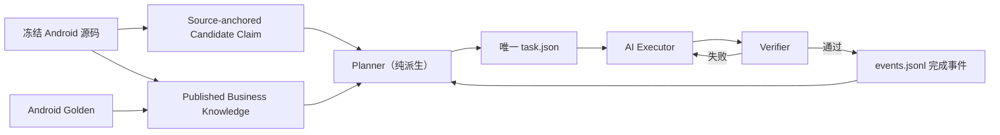

# Minimal Loop v2 架构与迁移合同

状态：已采用  
生效基线：`dff04334426fc0580e3de1acdd8472e096f37113`

## 为什么重构

旧控制面能够严格审计，但把一个交付重复物化成 Candidate、Recipe、WorkItem、
Evidence、Checkpoint、Recovery 和巨大 `state.json`。它已经超过 iOS 产品代码规模，
同时在 Business Knowledge 发布后仍停在 `queue_empty`。这说明成本主要花在控制面
自洽，而不是业务推进。

v2 的目标不是削弱业务、架构或验收约束，而是删除重复表示。

## 唯一权威链

只有三个受版本控制的 Loop 状态：

| 文件 | 作用 | 规模约束 |
|---|---|---:|
| `task.json` | 当前唯一任务；无任务时不存在 | 小于 8 KB |
| `events.jsonl` | 开始、验证、完成和长期知识事件 | 每事件一行 |
| `current.json` | 当前状态投影 | 小于 2 KB |

命令 stdout/stderr、截图、xcresult、结构化 actual 和比较报告进入
`.harness-runtime/loop`，不进入 Git。

## Task 如何产生

Planner 有两条纯派生入口：

1. 优先从 Coverage Ledger 找到 `delivery.state=planned` 的已发布 Claim，生成
   iOS Delivery Task；
2. 没有 Delivery 时，从源码锚定且要求 `android_characterization` 的 Candidate
   Claim 中选择依赖已闭合、范围最小的一项；
3. Characterization Task 只允许扩展 SourceLab、Oracle request registry、受保护
   Android Golden 及其 Business Knowledge/Coverage 发布结果，禁止先写 iOS 产品实现
   或手写 expected；
4. 两类任务都绑定精确 Requirement revision/clause、Android baseline、
   source path/blob/symbol 和 Architecture Driver；
5. 每次只生成一个 `task.json`，不生成候选或中间 Recipe。

逐切片 `AndroidMigrationIntent` 是更具体的 Requirement authority；若某个已满足依赖
的源码锚定 runtime Claim 尚无匹配 Intent，则由项目级已接受迁移章程
`REQ-ANDROID-MIGRATION-CHARACTERIZATION-001@1#RC-01` 续接。章程只授权真实 Android
刻画，不授权跳过 Golden 直接实现产品。业务知识不完整、Android baseline 漂移或章程
无效时该 Claim 不进入可执行队列；不得由 AI 猜测或扩大任务。

`queue_empty` 只表示不存在已规划 Delivery、可刻画 Candidate 或恢复节点，不能把
“没有逐切片 Intent”误报为 Android 真源已经迁移完成。

## 验证

书源任务必须输出结构化比较：

- `android_expected`
- `ios_actual`
- `canonical_request_plan`
- `first_divergence`

Verifier 不把退出码 `0` 直接当成功：测试命令必须证明实际执行了非零数量的测试；
Delivery 的 JSON stdout 必须包含上述字段、目标 Fixture，且 `status=equal`、
`first_divergence=null`；Characterization 必须同时形成受保护 Golden、Manifest/
Release Receipt 绑定和指向该 Golden 的 Published Coverage。

SourceLab 负责稳定网站刺激与故障模拟，Android Golden 才是业务期望。书源实现以源码
对齐为主，测试用于发现偏差，不能用有限用例反向定义全部书源语义。

UI 任务必须启动 iOS Simulator，验收页面结构、导航入口、多级菜单、关键状态和截图；
像素细节允许符合 iOS 平台习惯。

## 失败与恢复

普通失败只在当前任务上增加 attempt，并追加一个短
`verification_failed` 事件。不会复制出 `RECOVERY-002/003`。只有业务知识、架构决策
或外部权威真的发生变化时，Planner 才会产生新的任务。

AI Executor 反复调用幂等的 `advance`：空闲时启动任务，有产品变化时验证，验证通过
时请求项目记忆，相同失败工作区则返回 `repair` 而不重复执行。`events.jsonl` 是状态
恢复依据；`current.json` 是可重建投影。控制文件写入中断后，`advance` 先执行
`reconcile`，只恢复当前投影或删除未形成开始事件的孤立 `task.json`。JSON 投影使用
临时文件加原子替换，事件追加在返回前落盘；仓库外的单进程锁拒绝两个 Driver 并发
推进同一任务，避免重复开始或重复 attempt。

Loop 不从仓库内递归启动 Codex CLI。当前 Codex 任务负责 AI Executor，Loop 只负责
任务派生、范围约束、独立验证、恢复和项目记忆，这样不会重新引入已删除的 Agent
adapter、Supervisor daemon 和重复状态机。

## 项目信息沉淀

完成事件必须包含：

- 本次交付摘要；
- 当前能力状态；
- 架构是否变化及决策引用；
- 可复发踩坑与预防办法；
- 未完成事项和下一步。

长期稳定的业务知识进入 Business Knowledge；架构边界进入架构文档/ADR；一次运行的
大日志只放 runtime artifact。相同事实只保留一个权威位置，其他地方只引用 ID/path。

## 迁移验收线

v2 在删除旧控制面前必须满足：

1. 能从 POST Form published knowledge 直接生成
   `IOS-SOURCE-RUNTIME-POST-FORM-001`；
2. 能完成结构化书源 Golden 对齐；
3. 能连续生成下一任务；
4. `advance` 自动串联 `next/start/verify/complete`，`doctor` 与 `reconcile`
   可独立验证和恢复事件投影；
5. 旧完成历史压缩为 completion index/event 后，当前 HEAD 可删除重复
   Candidate/Recipe/WorkItem/Evidence/Checkpoint/state 投影；
6. Git 历史仍保留旧审计材料，当前运行不再依赖它们。
