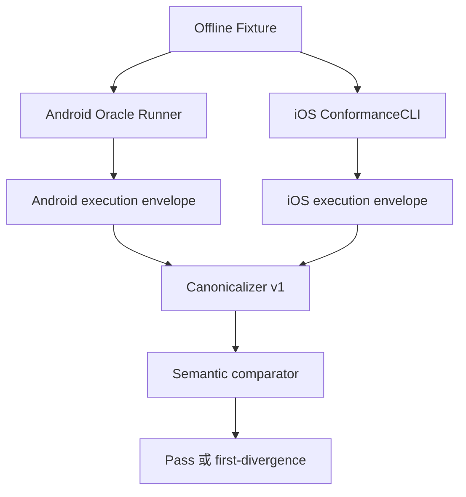

# 测试与 Android ↔ iOS 一致性

## 1. 测试金字塔

| 层级 | 内容 | 执行时机 |
|---|---|---|
| T0 | schema、项目记忆、路径策略、架构 import、golden manifest、工具链 | 每次循环 |
| T1 | format、受影响 Target 编译、纯单元测试 | 每次循环 |
| T2 | 指定 fixture 的 Android golden ↔ iOS 差分 | 每次规则/书源循环 |
| T3 | 全量离线 conformance | PR |
| T4 | SourceLab loopback HTTP、临时 SQLite、迁移、JS/WebKit integration | 中高风险 PR |
| T5 | 固定模拟器 XCUITest、snapshot、重启恢复 | Feature/Reader PR |
| T6 | live probe、性能、fuzz、恶意 ZIP/HTML、长稳 | nightly/release |

Minimal Loop 根据 Task 固定验收；AI 不能自行减少 required checks。

## 2. 同源 Fixture，双端 Runner



每个 fixture 固定：书源、输入、离线 HTTP 响应、clock、timezone、locale、random seed、大小/时间限制和 compatibility profile。网络默认禁止；真实网站不进入 conformance。

SourceLab 复用这些响应构建本地网站，但 T2/T3 仍必须走 FixtureTransport；ConformanceCLI 不得链接 NetworkFoundation。SourceLab 只提供刺激和原始字节，解析期望来自固定 Android commit 的受保护 golden。详见 `source-lab.md`。

每个 fixture/golden 必须回指 Requirement clause 与 Android Fact selection。源码入口只有 L2 时先生成 characterization；只有 runner 在固定 scenario 上产出绑定 fact inventory 的 L4 attestation 后，产品实现项才可进入 ready。SourceLab environment reference 不能代替这一步。

统一 envelope 按阶段记录：

- request plan：method、规范 URL、headers、body hash；
- decode：选择的 charset、证据、是否 lossy；
- rule stage：规则类型、输入 hash、输出类型和摘要；
- URL completion；
- typed final result；
- 稳定 error code 和 SourceStage。

精确比较 method、URL、body、类型、值、列表顺序、错误码/阶段。只规范化 Header 名大小写、JSON object key 顺序和换行；耗时、内存、trace ID 不比较。任何容差必须局部写在 fixture，禁止全局 fuzzy match。

差分失败必须给出首个分叉阶段和 JSON Pointer，例如 `DIFF_TYPE_COERCION @ /stages/3/output/value/0`，不能只报告“结果不同”。

## 3. Android Oracle 策略

初期允许 instrumentation runner 直接调用 `AnalyzeUrl / AnalyzeRule / WebBook`，通过 FixtureTransport 截断真实网络；后续再提取 JVM CLI。日常 PR 读取冻结、签名 manifest 中的 Android golden；nightly 或独立 golden proposal workflow 才重跑 Android oracle。

Android 是兼容基准，不是产品正确性的绝对定义。发现 Android bug 时记录 COMP/ADR，
明确选择保持兼容还是形成 iOS intentional difference。

## 4. Golden 防篡改

- 普通产品 Task 始终禁止修改 `ios/harness/goldens/**`。
- Minimal Loop 不提供 record/update golden 命令。
- 更新由独立 workflow 运行指定 Android commit，生成 create-only、内容寻址结果。
- manifest 绑定 fixture hash、golden hash、oracle commit、runner image 和 canonicalizer hash。
- 变更任一语义输入后，旧 verification 和 golden 立即 stale。
- snapshot reference 只能由 Simulator 验收任务更新。
- 产品代码出现 fixture ID、expected JSON 常量或 test-only 分支时直接失败。

## 5. 确定性与失败分类

固定 Xcode、Swift、SDK、模拟器、locale、timezone、动态字体、随机种子和网络响应。测试第一次失败、第二次通过不算成功，应归类 `NONDETERMINISTIC`。

标准失败分类：

```text
SPEC_INVALID          BASELINE_RED        SCOPE_VIOLATION
GOLDEN_MUTATION       DEPENDENCY_MUTATION FORMAT_OR_LINT
COMPILE               UNIT_REGRESSION     DIFF_REQUEST
DIFF_DECODE           DIFF_PARSE          DIFF_TYPE_COERCION
DIFF_ORDER            DIFF_ERROR_MAPPING  DATABASE_MIGRATION
UI_SNAPSHOT           SECURITY_POLICY     NONDETERMINISTIC
INFRASTRUCTURE        BUDGET_EXCEEDED     HUMAN_DECISION_REQUIRED
```

失败指纹由分类、check ID、fixture ID、stage、JSON Pointer 和归一化消息计算。相同指纹连续两次、基线红、越界、golden 修改、预算耗尽或需要扩大授权时必须停止，而不是继续随机尝试。

## 6. 验证新鲜度

Loop verification 绑定 Task、base/head、实际修改路径、workspace SHA-256、Android baseline、
fixture/golden 和固定命令输出摘要。验证后代码变化必须重新执行；完成事件只引用最后一次
匹配 workspace 的 verification。

- unit/conformance：输入 digest 变化即失效；
- live probe：24～72 小时；
- performance：30 天或硬件/工具链变化；
- App Store policy：每季度及提交前复核；
- release 验证：永久保留 manifest。

完整 xcresult、trace、截图和 DOM dump 放 CI artifact/object storage；Git 只保存脱敏摘要、URI 和 SHA-256。
